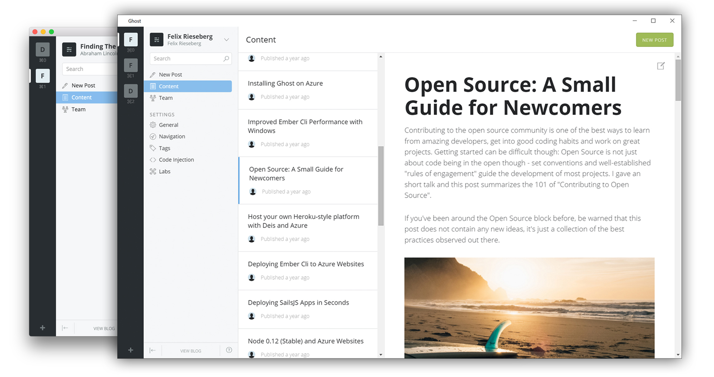

The project is maintained by a non-profit organisation called the **Ghost Foundation**, along with an amazing group of independent [contributors](https://github.com/TryGhost/Ghost-Desktop/contributors). We're trying to make publishing software that changes the shape of online journalism.

# Ghost Desktop
Ghost Desktop is currently in development - we're building a beautiful desktop application that allows you to easily manage multiple Ghost blogs and work without distractions. If you're interested in giving us a hand, [check out the contributing guide](https://github.com/TryGhost/Ghost-Desktop/tree/master/docs)!

# Copyright & License
Copyright (c) 2013-2016 Ghost Foundation - Released under the [MIT license](LICENSE).
